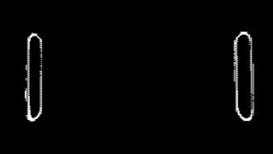
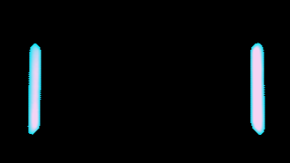

# armor_detector

- [armor_detector](#armor_detector)
  - [BaseDetectorNode](#basedetectornode)
    - [RgbDetectorNode](#rgbdetectornode)
    - [RgbDepthDetectorNode](#rgbdepthdetectornode)
  - [Detector](#detector)
    - [preprocessImage](#preprocessimage)
    - [findLights](#findlights)
    - [matchLights](#matchlights)
  - [NumberClassifier](#numberclassifier)
  - [三维位置解算](#三维位置解算)
    - [PnPSolver](#pnpsolver)
    - [DepthProcessor](#depthprocessor)

## BaseDetectorNode
识别节点基类

包含

### RgbDetectorNode
RGB识别节点

### RgbDepthDetectorNode
RGBD识别节点

## Detector
装甲板识别器

### preprocessImage
预处理

由于一般工业相机的动态范围不够大，导致若要能够清晰分辨装甲板的数字，得到的相机图像中灯条中心就会过曝，灯条中心的像素点的值往往都是 R=B。根据颜色信息来进行二值化效果不佳，并且将图像变换到 HSV 或 HLS 颜色空间都会比变换到灰度图耗时大，因此此处选择了直接通过灰度图进行二值化，将灯条的颜色判断放到后续处理中。

|  |  |  |
| :---------------: | :-------------------: | :--------------------: |
|       原图        |    通过颜色二值化     |     通过灰度二值化     |

### findLights
寻找灯条

通过 findContours 得到轮廓，再通过 minAreaRect 获得最小外接矩形。此处我们定义了继承自 RotatedRect 的 Light 类，在构造函数中对 minAreaRect 的返回矩形进行一系列处理，获得 Light 的上下顶点，倾斜角度等属性。

通过对 Light 长宽比和倾斜角度的判断，可以高效的筛除形状不满足的亮斑。

判断灯条颜色这里采用了对轮廓内的的R/B值求和，判断两和的的大小，若 `sum_r > sum_b` 则认为是红色灯条，小于则认为是蓝色灯条。

|  |  |
| :---------------: | :----------------: |
| 提取出的红色灯条  |  提取出的蓝色灯条  |

### matchLights
匹配灯条

## NumberClassifier
数字分类器

## 三维位置解算

### PnPSolver
PnP解算器

### DepthProcessor
深度图处理器

